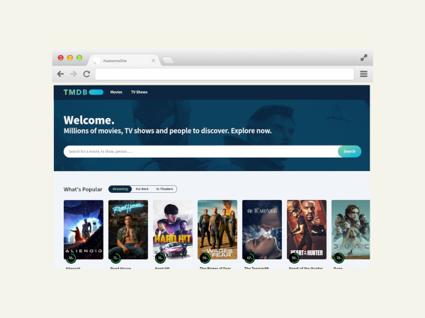

# MOVIE DATABASE CLONE

| see preview from [here](https://movies-hazel-gamma.vercel.app/)



a cutting-edge movie database website clone crafted with the latest technologies. Explore a vast collection of films with ease through our intuitive interface and sleek design. Dive into a world of cinematic wonders with attractive UI features that enhance your browsing experience.

## Tasks

- [x] fix the tag searchParameter on first load
- [x] make footer
- [x] deploy to vercel <!-- after changing some vercel build folder -->
- [x] use nextJs Image component
- [ ] install shadcn
- [ ] make movie modal or drawer
- [ ] add favorite movies with a toast msg (locally)
- [ ] add upstash rate limiter

## getting started

```bash
# install dependencies
pnpm install

# run in dev mode
pnpm dev

# build project
pnpm build
```

## Tech stack

- React
- NextJs 14
- TailwindCSS
- DaisyUI

## Contributing

Contributions are always welcome!

See `contributing.md` for ways to get started.

Please adhere to this project's `code of conduct`.

## License

[MIT](https://choosealicense.com/licenses/mit/)
